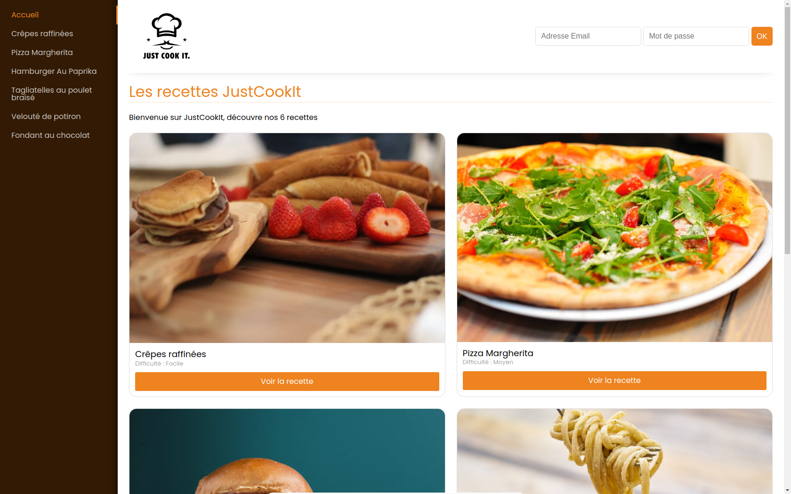

# JustCookIt

  

Bienvenue dans le projet JustCookIt !
L'objectif de ce projet est de créer une application de recettes en utilisant React / JS, SCSS, Redux et React Router.

## Description

JustCookIt est une application de recettes qui permet aux utilisateurs d'explorer et de consulter diverses recettes. Les utilisateurs peuvent parcourir une collection de recettes, consulter les détails de chaque recette et même se connecter avec un compte utilisateur pour enregistrer leurs recettes favorites en utilisant une adresse e-mail et un mot de passe.

## Fonctionnalités

- Parcourir les recettes : Explorez une variété de recettes savoureuses disponibles dans la collection.
- Afficher les détails : Consultez les détails complets de chaque recette, y compris les ingrédients, les instructions de cuisson et les temps de préparation.
- Enregistrer les recettes favorites : Connectez-vous à votre compte utilisateur pour enregistrer vos recettes préférées et y accéder facilement à tout moment.
- Gestion du compte : Créez un compte utilisateur avec une adresse e-mail et un mot de passe pour accéder à des fonctionnalités personnalisées et à votre liste de recettes favorites.

## Captures d'écran

<!--  -->

## Remarques

Ce projet a été réalisé dans le cadre d'un exercice pour pratiquer les concepts du développement React, Redux et React Router.
